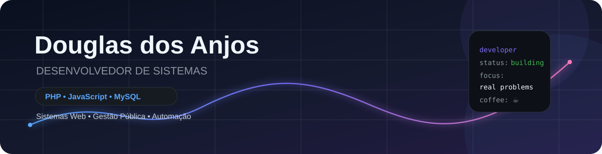
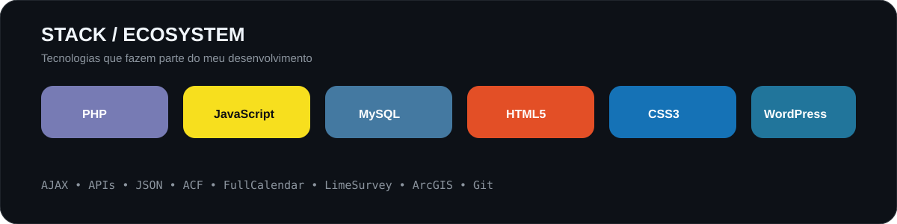
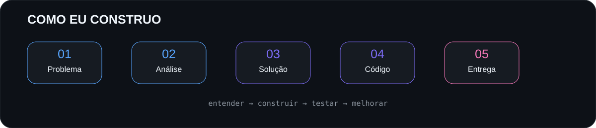

  

  

---

## 👨‍💻 Sobre mim

Desenvolvedor de sistemas com experiência prática em **PHP, JavaScript, MySQL, HTML5, CSS3 e WordPress**, atuando na construção, manutenção e evolução de sistemas utilizados em situações reais.

Minha experiência também envolve **AJAX, APIs, JSON, ACF, FullCalendar, LimeSurvey, ArcGIS e Git**, especialmente em soluções para processos administrativos, gestão pública e editais culturais.

Meu foco é simples:

> **entender o problema, construir a solução e fazer a tecnologia funcionar para quem precisa dela.**

---

---

## 🧰 Stack principal

  

  

---

## ⚙️ O que eu desenvolvo

| 🖥️ Sistemas Web | 🗄️ Dados | 🔌 Integrações | 📝 CMS |
|:---:|:---:|:---:|:---:|
| PHP | MySQL | AJAX | WordPress |
| JavaScript | SQL | APIs | ACF |
| HTML5 | CRUD | JSON | Plugins |
| CSS3 | Modelagem | Endpoints | Customizações |

---

---

## 🚀 Projetos em destaque

### 🚚 Gestão de Frotas

Sistema para gerenciamento de **veículos, motoristas e agendamentos**, com calendário e comunicação assíncrona.

`PHP` `JavaScript` `MySQL` `WordPress` `ACF` `FullCalendar` `AJAX`

**Status:** 🟡 Em desenvolvimento

---

### 🎫 Helpdesk App

Sistema CRUD para **abertura, acompanhamento e gerenciamento de chamados**.

`PHP` `MySQL` `HTML5` `CSS3` `JavaScript`

**Status:** 🟢 Concluído

---

### 🧾 Finan$

Projeto voltado para **MEIs**, com foco em organização financeira e emissão/controle de notas fiscais.

`PHP` `MySQL` `JavaScript`

**Status:** 🟡 Em desenvolvimento

---

## 🏛️ Tecnologia aplicada a problemas reais

Tenho experiência trabalhando com soluções digitais ligadas a **gestão pública, processos administrativos, formulários online e editais culturais**.

Isso significa lidar não apenas com código, mas também com:

- 🔐 controle de acesso e validações;
- 📝 formulários e fluxos de inscrição;
- ⏱️ regras de prazo e encerramento;
- 🗃️ armazenamento e consulta de dados;
- 🔄 integrações e requisições AJAX;
- 🛠️ manutenção e correção de sistemas em produção;
- 📊 organização de informações para processos administrativos.

---

## 📊 GitHub Analytics

 

---

## 📈 Atividade

---

## 📊 Mapa de Contribuições

---

## 🌱 Atualmente estudando

  

**Java** · **Engenharia de Software** · **React** · **Node.js** · **TypeScript** · **Inteligência Artificial**

---

## 💡 Minha filosofia

### `PROBLEMA` → `ANÁLISE` → `SOLUÇÃO` → `CÓDIGO` → `TESTE` → `ENTREGA`

 

**Código bom não é o código mais complicado.**  
**É o código que resolve o problema certo.**

---

## 📫 Contato

  

**Sempre aprendendo. Sempre construindo. 🚀**

